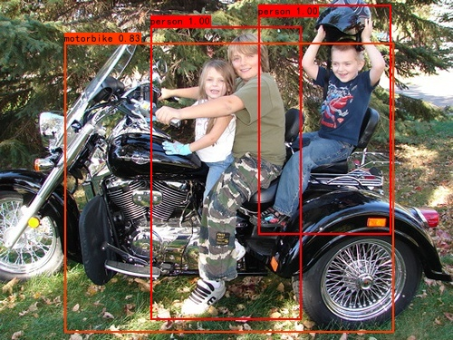

# YOLO-v3



## Weights
You can download pretrained weights (yolo_weights.pth) from https://pan.baidu.com/s/1hCV4kg8NyStkywLiAeEr3g   
and put it into model_data/yolo_weights.pth  
code:6da3

## Prepare
```
# Run voc_annotation.py to generate 2012_train.txt and 2012_val.txt
python voc_annotation.py
```

## Train
```
# Start training with: 
python train.py
```

## Predict
If you want to use your own training weights, please modify the self.model_path and self.classes_path in yolo.py
```
# Detect a single image: 
python predict.py --mode image --input test.jpg
# Detection video: 
python predict.py --mode video --input test.mp4
```
